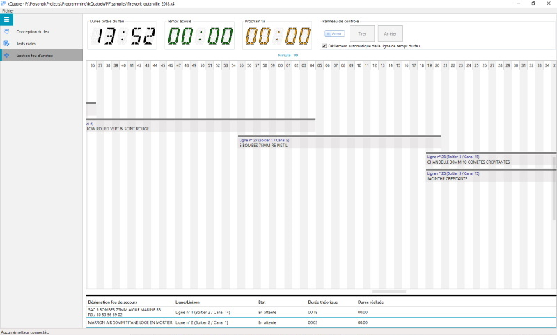

# kQuatre

## Foreword

Each year on French National Day, beautiful fireworks are set off throughout the country. My dad is in charge of this responsability within his municipality.
Setting up fireworks can be a big deal, very timeconsuming...meters of wires must be connected with each others.

One day, as we were preparing such an event, I told him : "What about creating a system (software AND hardware) to avoid unrolling all these cables...He answered me : I dare you !"

This is how this project is born...

Written in C#, kQuatre software aims at creating and firing fireworks automatically. No more cables, system is wireless (works thanks to LoRa technology).

## Electronic Datasheet

Wanna realise your own firework receiver....

Here is a link to the datasheet : <https://easyeda.com/fguiet/kquatre>

## In real life

* kQuatre software - Design your firework

* kQuatre software - Testing LoRa communication

* kQuatre software - real time fire work management console

* LoRa 868Mhz Arduino based transceiver and Arduino Mega based receiver

* Discovering what's inside...

* And deeper inside ...

As you can see, it quite simple...relays, LoRa draguino shield, 12v batteries ...

* In the field...

* kQuatre sofware ! ready to go !

